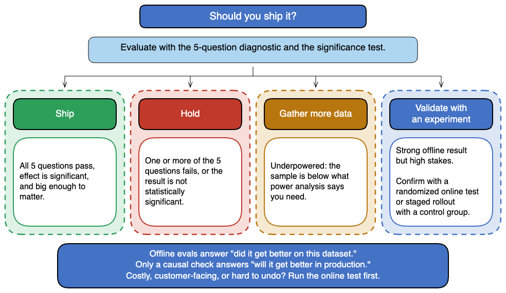
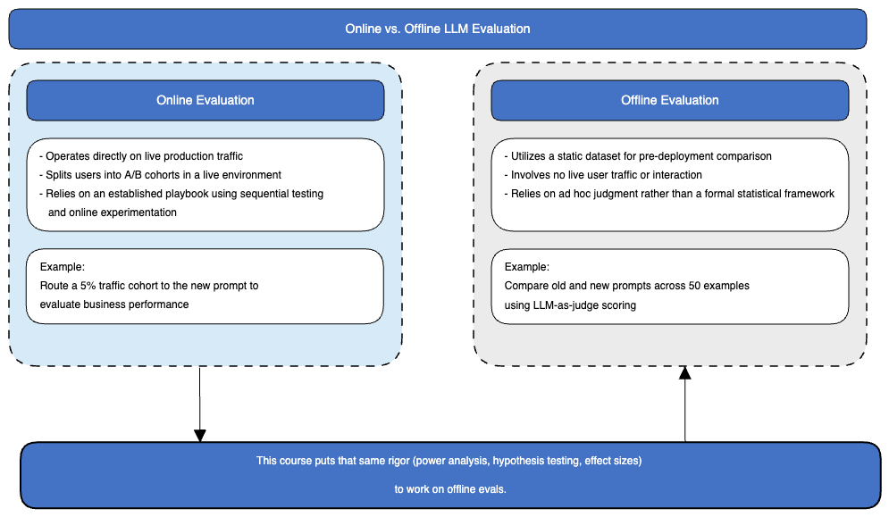

# Statistical Testing for LLM Evaluations

*Design experiments that catch the improvements worth shipping*

Companion notebooks for the O'Reilly live course **Statistical Testing for LLM Evaluations**, taught by **Rudrendu Paul**.

**Your LLM eval says the new version is better. Should you trust it? Often not.** Most LLM evals are underpowered, use the wrong statistical test, or hide a failure behind one average score. This repo gives you a five-question check, a ship-or-hold decision framework, and four notebooks that prove each point. Every notebook runs on synthetic data, so `pip install` is the only setup required.

---

## Before you ship, ask five questions

Before you act on any eval result, run it through five questions. The one-page version is in [`5-question-diagnostic-framework.md`](5-question-diagnostic-framework.md).


1. Does the metric measure what matters?
2. Was the experiment randomized?
3. Was the sample large enough?
4. Is the LLM-as-judge unbiased?
5. Will the offline result hold once it meets live users?

If all five pass, ship. If any fail, hold, gather more evidence, or run a causal check.

---

## Three ways an eval misleads you

1. **Too little data.** With 50 examples per prompt, a 5-point gain has only 10.4% power, so you miss it about nine times out of ten. It takes 847 per prompt. (Notebook 01, question 3)
2. **The wrong test.** On the same 200 paired cases, a paired t-test says no difference (p = 0.1024) and a Wilcoxon signed-rank test finds the improvement (p = 0.0078). The two ask different questions. (Notebook 02)
3. **A number you cannot trust.** One end-to-end score can hide a 14-point retrieval failure behind a 6-point dip, and an LLM judge can favor whichever answer comes first. (Notebook 03, questions 1 and 4)

---

## Then decide: ship, hold, gather more data, or run an experiment

The diagnostic leads to one of four outcomes. A causal check means a randomized online test, or a staged rollout with a control group. Run one when a wrong call is costly, customer-facing, or hard to undo.



---

## The proof: four notebooks you can run

| # | Notebook | What it shows | Open in Colab |
|---|----------|---------------|---------------|
| 01 | [Power analysis for LLM evals](notebooks/01-power-analysis-llm-evals.ipynb) | Why 50 examples cannot see a 5-point gain. Detecting a 5-point faithfulness gain on a noisy 0-100 judge score needs 847 examples per arm, not 50. | [](https://colab.research.google.com/github/RudrenduPaul/statistical-testing-for-llm-evaluations/blob/main/notebooks/01-power-analysis-llm-evals.ipynb) |
| 02 | [Hypothesis testing for LLM metrics](notebooks/02-hypothesis-testing-llm-metrics.ipynb) | The same 200 paired test cases where a paired t-test says "no difference" (p=0.10) and a Wilcoxon signed-rank test finds the improvement (p=0.0078), and why. | [](https://colab.research.google.com/github/RudrenduPaul/statistical-testing-for-llm-evaluations/blob/main/notebooks/02-hypothesis-testing-llm-metrics.ipynb) |
| 03 | [RAG evaluation case study](notebooks/03-rag-evaluation-case-study.ipynb) | In a simulation, a 14-point retrieval-recall drop (0.82 to 0.68) behind a 6-point end-to-end drop (0.80 to 0.74), and the component table that shows where it came from. | [](https://colab.research.google.com/github/RudrenduPaul/statistical-testing-for-llm-evaluations/blob/main/notebooks/03-rag-evaluation-case-study.ipynb) |
| 04 | [Agent evaluation mini-case](notebooks/04-agent-evaluation-mini-case.ipynb) *(bonus)* | Bonus. In a simulation, the agent that leads on final-answer quality falls behind under production constraints (84.5% to 70.5% task success) while the agent with better process metrics holds up (81.5% to 79.5%). | [](https://colab.research.google.com/github/RudrenduPaul/statistical-testing-for-llm-evaluations/blob/main/notebooks/04-agent-evaluation-mini-case.ipynb) |

> **Notebook 04 is a bonus.** The live course covers power analysis, hypothesis testing, and the RAG case in 60 minutes. The agent notebook is an optional extra to explore on your own.

> **Open in Colab:** click any badge to launch the notebook in Google Colab (no local setup). You can also download the `.ipynb` and upload it to Colab, or run it locally.

All notebooks ship with their outputs saved, so you can read the charts and tables without running a single cell.

Each notebook opens with a one-picture workflow, so you can follow the steps and decisions without reading the code.

**Statistical tests used**

| Notebook | Test or measure | Why |
|---|---|---|
| 01 | Two-sample t-test, Cohen's d, power analysis (TTestIndPower) | Two independent prompt groups; size the eval before collecting data |
| 02 | Paired t-test, Wilcoxon signed-rank | The same 200 cases scored twice; compare "did the average move" with "does B tend to win" |
| 03 | Mann-Whitney U | Two independent periods of queries with bounded, skewed scores |
| 04 | McNemar (paired pass or fail) | The same tasks run on the benchmark and again under production limits |

---

## Why offline evals need the rigor of online tests

Online evaluation, A/B testing on live traffic, carries a statistical playbook: sequential testing, online controlled experiments, established practice. Offline evaluation, the fixed-dataset comparison you run before anything ships, usually does not. This course closes that gap.



Every notebook in this repo runs an offline comparison: a fixed dataset, no live users, old vs. new prompt or model compared side by side. The statistical toolkit here (power analysis, hypothesis testing) is what online experimentation carries and offline evals typically skip.

---

## What each notebook shows

### Notebook 01: Power analysis for LLM evals

**Question:** Can 50 examples see a 5-point gain?


- **What it does:** Sets the truth (Prompt A averages 72, Prompt B averages 77, score SD 36.7), simulates noisy scores, and compares the prompts with 50 examples each and then with 847 each.
- **Key results:** At 50 per prompt the measured gap is 5.36 points and p = 0.485 (not significant). At 847 per prompt the gap is 4.94 and p = 0.0054. Power at n = 50 is 10.4%. Reaching 80% power takes 847 per prompt, about 17 times more.
- **Tests and measures:** Two-sample t-test, Cohen's d (0.136), power analysis (`TTestIndPower`), power curves, and a sample-size table (3 points: 2,351, 5 points: 847, 10 points: 213 per prompt).
- **Takeaway:** Size the eval before you collect the data. Missing a gain at small n is a weak test, not proof the prompt failed.

### Notebook 02: Hypothesis testing for LLM metrics

**Question:** Why do the t-test and Wilcoxon disagree on the same scores?


- **What it does:** Scores 200 paired test cases (1 to 5 rubric) under two prompts, counts the per-case changes, and runs both tests.
- **Key results:** B wins 105 cases by one point, ties 65, and loses 30 (27 of them by 2 to 4 points). The paired t-test gives t = -1.64, p = 0.1024 (not significant). The Wilcoxon signed-rank test gives W = 3458, p = 0.0078 (significant). The 65 ties are set aside, so 135 cases decide the result.
- **Tests and measures:** Paired t-test (did the average move?) and Wilcoxon signed-rank (does B tend to win case by case?).
- **Takeaway:** The tests ask different questions. Pick the test from the design before you look at p-values, then decide on what the 30 losses cost, not on one p-value.

### Notebook 03: RAG evaluation case study

**Question:** How does a 14-point retrieval failure reach the dashboard as a 6-point alert?


- **What it does:** Simulates a RAG system with 500 queries before and 500 after a drift, scores four components, and combines them into one end-to-end score (weights 0.2, 0.2, 0.3, 0.3). It then tests the end-to-end score and each component.
- **Key results:** The end-to-end score falls from 0.803 to 0.741 (6.25 points, p < 0.0001), so the alert fires. By component: retrieval recall 0.819 to 0.679 (14.0 points), context relevance -7.1, faithfulness -6.3, answer relevance 0.812 to 0.808 (-0.5, p = 0.1912, not significant).
- **Tests and measures:** Mann-Whitney U (independent periods, bounded and skewed scores, one-sided "did it decline?"), run on the end-to-end score and on each component.
- **Takeaway:** The end-to-end score is a weighted average. Drops of 14, 7, 6 and 0 average to about 6, so test the components separately to find the failure. The drift is simulated, so the numbers show the mechanism, not field data.

### Notebook 04 (bonus): Agent evaluation mini-case

**Question:** Why is the final answer not enough for agents?


- **What it does:** Simulates two agents (Agent A brute-forces answers, Agent B plans first), scores four levels, then adds production limits: latency, timeouts and context overflow.
- **Key results:** On the benchmark, Agent A leads on final answer quality and task success (0.845 vs. 0.815). Agent B leads on tool selection (0.845 vs. 0.633) and trajectory efficiency (0.800 vs. 0.515). Under production limits Agent A falls from 0.845 to 0.705 and Agent B from 0.815 to 0.795.
- **Tests and measures:** McNemar test on the paired benchmark and production outcomes of the same 200 tasks. Agent A: 28 tasks flipped to failure, none the other way, p = 7.451e-09. Agent B: 4 flipped, none the other way, p = 0.125.
- **Takeaway:** Score the process, then stress it, before trusting the final answer. The penalties are coded into the simulation, so it illustrates the mechanism, not field data.

---

## Run locally

```bash
git clone https://github.com/RudrenduPaul/statistical-testing-for-llm-evaluations.git
cd statistical-testing-for-llm-evaluations
python -m venv .venv && source .venv/bin/activate   # optional
pip install -r requirements.txt
jupyter lab
```

Python 3.10+ is recommended. No API keys are required. All data is synthetic and generated inside each notebook.

---

## FAQ

**How many examples do you need to detect a change in an LLM eval?**
It depends on the effect size and the metric's noise. Detecting a 5-point faithfulness gain on a noisy 0-100 judge score needs 847 examples per arm in the notebook's simulation (score SD about 37), not the 50 most teams run.

**Which statistical test catches an LLM improvement a t-test misses?**
On paired eval data, a Wilcoxon signed-rank test can catch an improvement a t-test reports as no difference (p=0.10 for the t-test vs. p=0.0078 for Wilcoxon in notebook 02).

**Can a small end-to-end RAG dip hide a retrieval regression?**
Yes. Notebook 03 simulates a 14-point retrieval-recall collapse (0.82 to 0.68) hidden behind a 6-point end-to-end dip (0.80 to 0.74), and the component-level evaluation design that surfaces it.

**Does an agent that leads a benchmark hold up in production?**
Not always. In the simulated bonus notebook 04, Agent A leads the benchmark (0.845 task success) then drops under production constraints (0.705), while Agent B holds (0.795) and ends ahead.

---

## Further reading (all O'Reilly)

- *Practical Statistics for Data Scientists*, Peter Bruce, Andrew Bruce, and Peter Gedeck (O'Reilly)
- *Evals for AI Engineers*, Shreya Shankar and Hamel Husain (O'Reilly, 2026)
- *AI Engineering: Building Applications with Foundation Models*, Chip Huyen (O'Reilly, 2025)

---

## Connect

- LinkedIn: [linkedin.com/in/rudrendupaul](https://www.linkedin.com/in/rudrendupaul)
- GitHub: [github.com/RudrenduPaul](https://github.com/RudrenduPaul)
- ORCID: [0009-0008-0141-4690](https://orcid.org/0009-0008-0141-4690)
- Medium: [medium.com/@rudrendupaul](https://medium.com/@rudrendupaul)

Licensed under the MIT License. See [LICENSE](LICENSE).
